# LoremIpsum-Dev-Forum
LoremIpsum is a single page application (SPA) and represent small discussion forum. 
React.js + Vite used in front-end, and SoftUni Practice Server for back-end service.

# Forum App Features

1. Home Page:
    * All users can view the home page with navigation and latest topics.
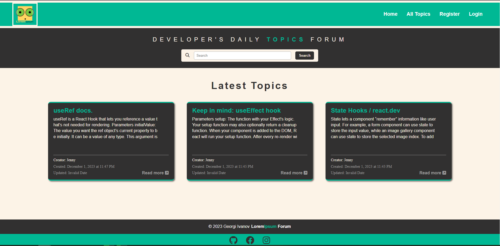
2. Topics Page:
    * A page displaying all topics, visible to all users.
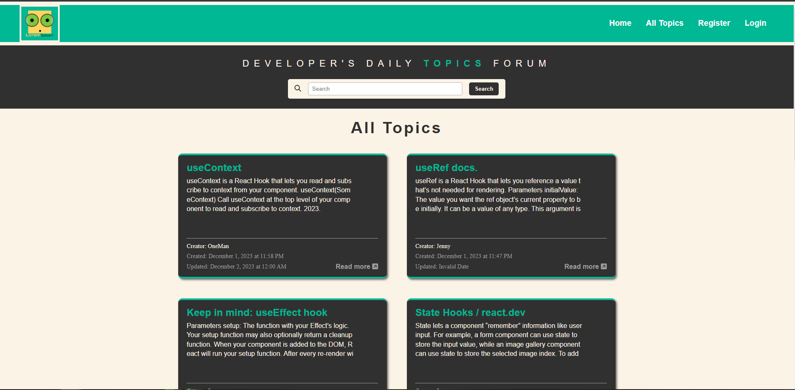
3. User Registration:
    * Users can register for an account.
    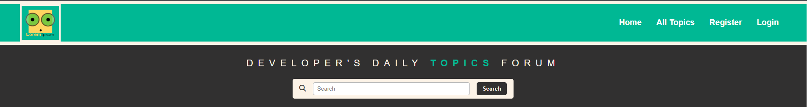
    
    * Form validation:
        * Username and password must be a minimum of 5 characters.
        * Valid email format is required.
        * Password and confirm password must match.
    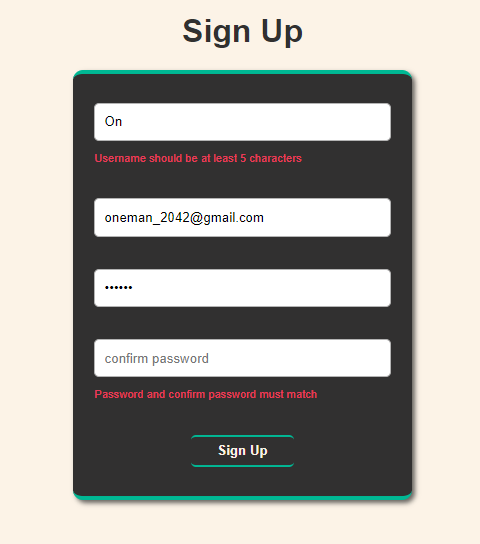
    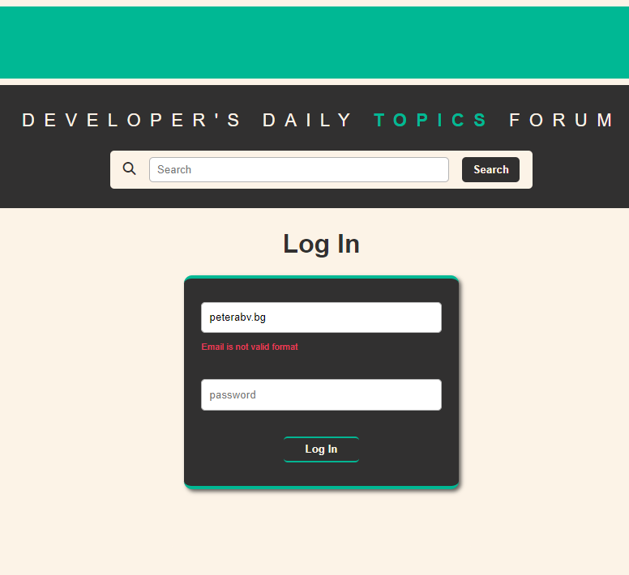
4. Create New Topic:
    * Registered users can create and post new topics.
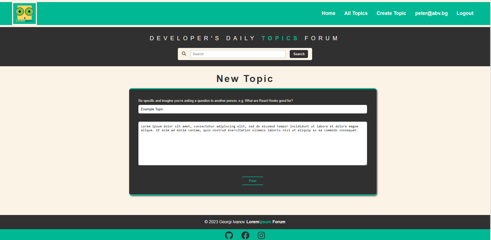
5. Post Answers:
    * Users can post answers to existing topics, whether they created the topic or not.
    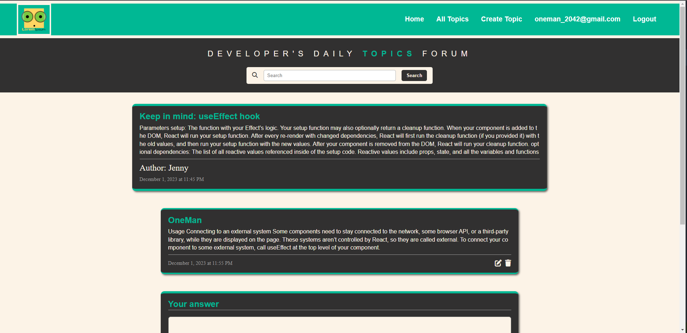
6. Edit and Delete:
    * Logged-in users have the ability to edit and delete their own topics and answers.
    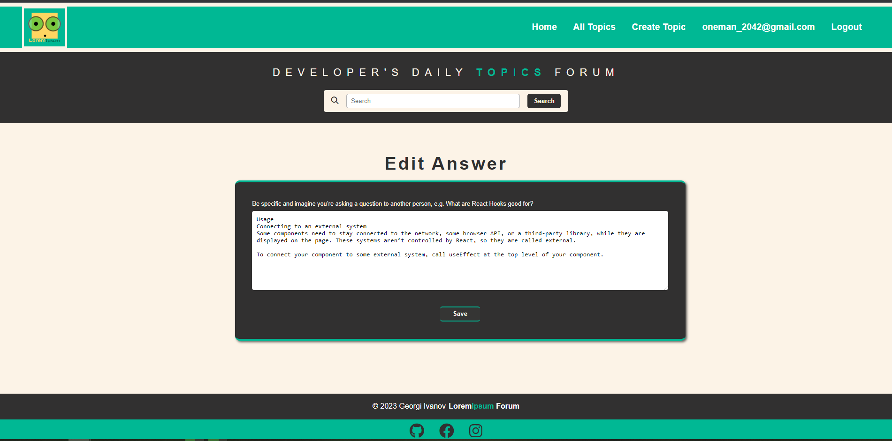
    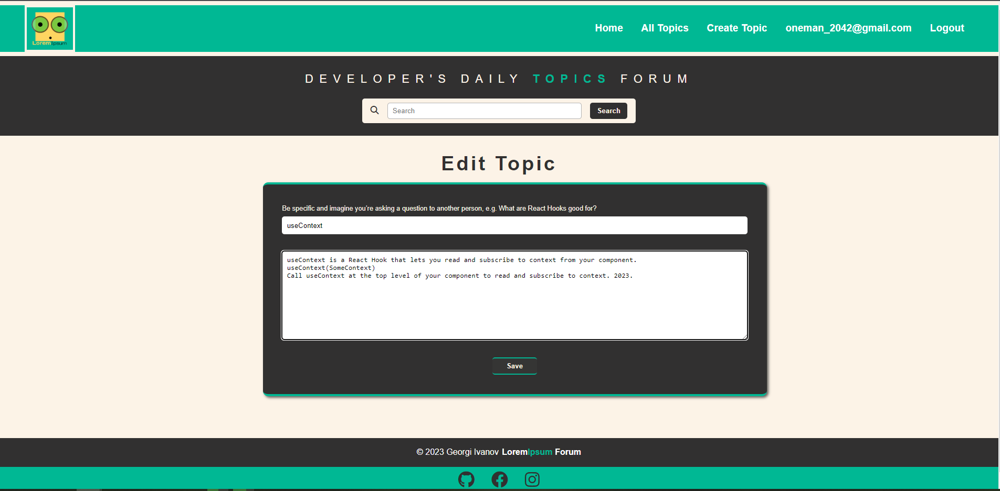
    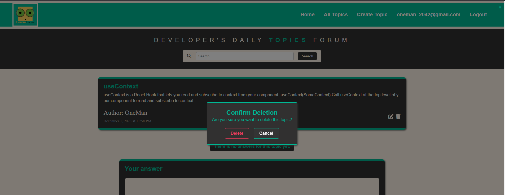
7. Search Functionality:
    * Users, both logged in and not, can use the search feature.
    * Search is based on technology names such as React, HTML, JavaScript, etc.
    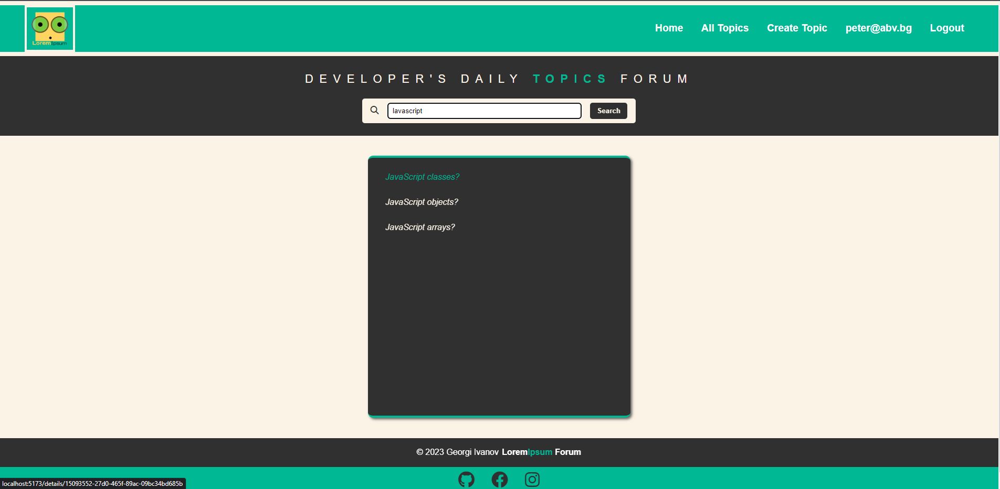
8. 404 Page:
    * A custom 404 page for handling page-not-found situations.
    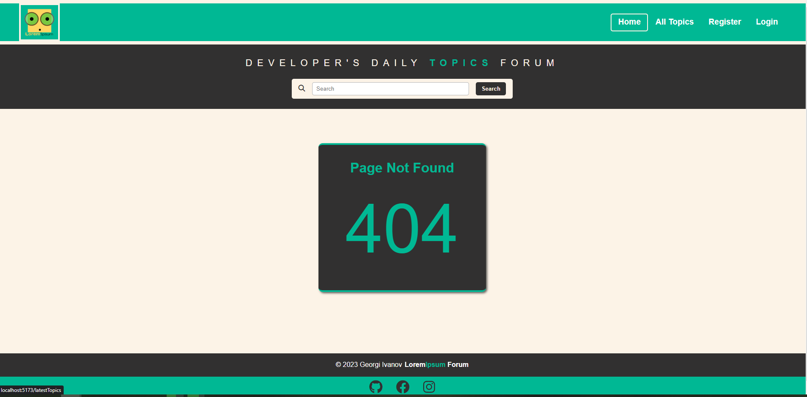

Steps to follow for local installation and review the application:
1. Clone the repository: https://github.com/11tag11/LoremIpsum-Personal-React-Project-SoftUni
2. Navigate to server folder and use the following command:
    * node server.js - to start the server;
3. Navigate to client folder and use the following commands:
    * npm install - install packages and dependencies;
    * npm run dev - run the application in development mode;

